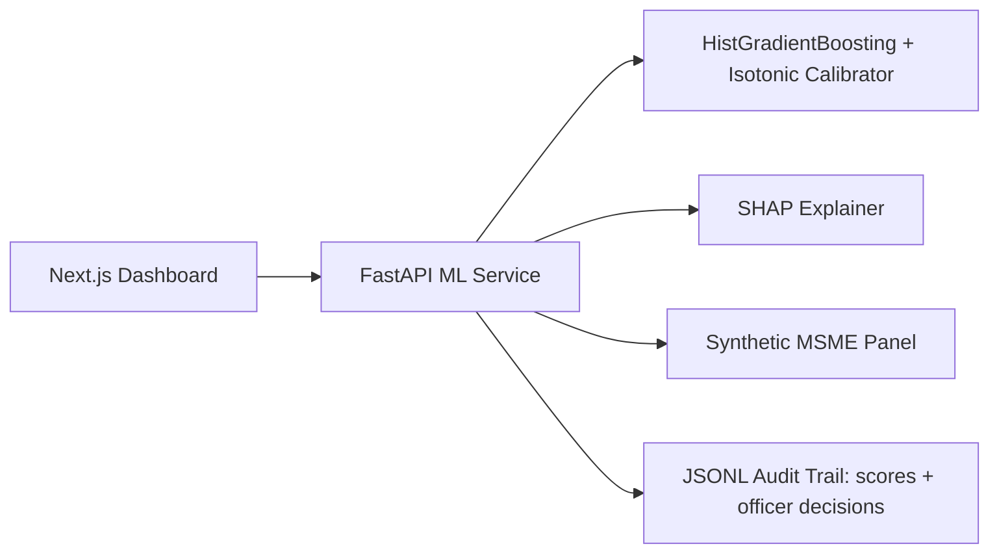

# Sentinel Architecture

## Overview

Sentinel is a three-tier system designed for AWS portability (Stage 2 sandbox migration).

## Components

### ML Pipeline (`ml/`)
- **generate_data.py**: Seeded synthetic MSME panel (borrower behavior + bank-internal + public-domain + unstructured — the problem statement's mandated input classes), Udyam-consistent, with segment risk loadings and an unobserved-heterogeneity shock
- **features.py**: Feature engineering + NLP distress scoring (normalization constants frozen at fit time for train/serve consistency); schema-robust defaults; persisted TF-IDF vectorizer; public-domain features (electricity consumption trend, EPFO headcount trend, Udyam registration)
- **segments.py**: Segment assignment, RAG (Red/Amber/Green) thresholds, PD masterscale, RBI SMA classification (trailing-12m proxy), evidence-gated IFRS-9 staging, reason-code taxonomy (incl. PUB codes)
- **train.py**: Class-weighted HistGradientBoosting with isotonic calibration; operating threshold selected on a validation split (test set untouched); saves model + vectorizer + thresholds + held-out test predictions
- **evaluate.py**: Held-out AUC-ROC, PR-AUC, KS, Gini, calibration, lift/gains, KS plot, per-segment metrics, early-warning lead time
- **monitoring.py**: Population Stability Index (PSI) drift computation

### Backend (`backend/`)
- FastAPI REST API with OpenAPI docs
- Scoring engine: PD → RAG (Red/Amber/Green) bucketing + PD masterscale rating (G1-G10) + RBI SMA category (trailing-12m proxy) + evidence-gated IFRS-9 stage (Stage 3 requires 90+ DPD objective evidence) + ECL = PD × LGD × EAD (flat illustrative LGD 0.45)
- Hazard curve: discrete-time survival decomposition whose cumulative 12-month PD equals the headline PD exactly
- SHAP explainer (built once, cached) → reason codes mapped to a standardized taxonomy
- Human-in-the-loop decision capture: `POST /decisions` records the officer's disposition (acknowledge / override / escalate + note + officer name); `GET /decisions/{account_id}` returns the decision history
- Portfolio aggregation, `/monitoring/drift` (PSI methodology demo vs a simulated stressed population), and a JSONL audit trail covering every score and every officer decision
- Schema-robust: batch rows validated through the same Pydantic schema as `/predict` (invalid rows skipped and reported), missing columns imputed with an explicit warning, extra columns ignored, unseen categories tolerated

### Frontend (`frontend/`)
- Next.js 14 App Router + Tailwind CSS
- Portfolio dashboard with KPIs, sector heatmap, sortable table
- Account detail with PD gauge, RAG badge, rating/SMA/IFRS-9 chips, reason codes, hazard curve, and an officer decision panel (acknowledge / override / escalate) wired to `/decisions`
- Batch CSV upload for scoring, surfacing skipped-row reports and imputed-column warnings

## Data Flow

1. Observation month `t`: features computed from history up to `t`
2. Label: default occurs in window `(t, t+12]`
3. Model outputs calibrated PD (0-1)
4. Segment-specific thresholds map PD → RAG (Red/Amber/Green) bucket; PD → rating grade; trailing DPD → SMA category; RAG + DPD evidence → IFRS-9 stage
5. SHAP values → standardized reason codes (taxonomy)
6. Loan officer reviews and disposes (human-in-the-loop): the disposition (acknowledge / override / escalate + note + officer name) is recorded via `POST /decisions` to the same JSONL audit trail as the score, retrievable via `GET /decisions/{account_id}`

## Deployment & Stage-2 Mapping

Stage-1 hosting is 100% open source. Stage-2 maps cleanly to a bank/AWS sandbox.

| Component | Stage 1 (open source) | Stage 2 (Sandbox / AWS) |
|-----------|-----------------------|-------------------------|
| API | Hugging Face Space (Docker) / self-hosted `docker-compose` | ECS Fargate |
| Model artifacts | Bundled in image | S3 + SageMaker |
| Data | Synthetic Parquet | IDBI sandbox APIs (column-mapped, retrained) |
| Frontend | Netlify / Vercel / Cloudflare Pages | Amplify / S3+CloudFront |
| Entry | Direct URL | API Gateway + ALB |

## Security & Compliance

- No real PII in Stage 1 (synthetic data only — DPDP Act 2023-safe)
- CORS restricted to frontend origin in production
- Audit trail on every prediction and every officer decision (timestamp, model version, PD, RAG, SMA, stage, disposition)
- Aligned to the live RBI regime (IRAC / SMA / EWS-RFA); explainable, human-in-the-loop with recorded dispositions, no autonomous credit decisions — consistent with the direction of RBI's FREE-AI committee. RBI IT Outsourcing / cloud directions become relevant for Stage-2 deployment
