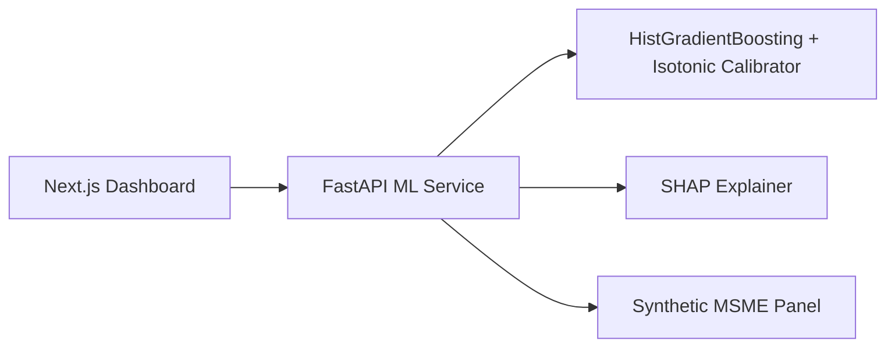

# Sentinel Architecture

## Overview

Sentinel is a three-tier system designed for AWS portability (Stage 2 sandbox migration).

## Components

### ML Pipeline (`ml/`)
- **generate_data.py**: Seeded synthetic MSME panel (structured + behavioral + unstructured), Udyam-consistent, with segment risk loadings and an unobserved-heterogeneity shock
- **features.py**: Feature engineering + NLP distress scoring; schema-robust defaults; persisted TF-IDF vectorizer
- **segments.py**: Segment assignment, RAG (Red/Amber/Green) thresholds, PD masterscale, IFRS-9 staging, reason-code taxonomy
- **train.py**: Class-weighted HistGradientBoosting with isotonic calibration; saves model + vectorizer + thresholds + held-out test predictions
- **evaluate.py**: Held-out AUC-ROC, PR-AUC, KS, Gini, calibration, lift/gains, KS plot, per-segment metrics, early-warning lead time
- **monitoring.py**: Population Stability Index (PSI) drift computation

### Backend (`backend/`)
- FastAPI REST API with OpenAPI docs
- Scoring engine: PD → RAG (Red/Amber/Green) bucketing + PD masterscale rating (G1-G10) + IFRS-9 stage (1/2/3) + ECL
- SHAP explainer (built once, cached) → reason codes mapped to a standardized taxonomy
- Portfolio aggregation, `/monitoring/drift` (PSI), and a JSONL audit trail on every decision
- Schema-robust: missing columns imputed, extra columns ignored, unseen categories tolerated

### Frontend (`frontend/`)
- Next.js 14 App Router + Tailwind CSS
- Portfolio dashboard with KPIs, sector heatmap, sortable table
- Account detail with PD gauge, RAG badge, reason codes, hazard curve
- Batch CSV upload for scoring

## Data Flow

1. Observation month `t`: features computed from history up to `t`
2. Label: default occurs in window `(t, t+12]`
3. Model outputs calibrated PD (0-1)
4. Segment-specific thresholds map PD → RAG (Red/Amber/Green) bucket; PD → rating grade + IFRS-9 stage
5. SHAP values → standardized reason codes (taxonomy)
6. Loan officer reviews and decides (human-in-the-loop); decision logged to audit trail

## Deployment & Stage-2 Mapping

Stage-1 hosting is 100% open source. Stage-2 maps cleanly to a bank/AWS sandbox.

| Component | Stage 1 (open source) | Stage 2 (Sandbox / AWS) |
|-----------|-----------------------|-------------------------|
| API | Hugging Face Space (Docker) / self-hosted `docker-compose` | ECS Fargate |
| Model artifacts | Bundled in image | S3 + SageMaker |
| Data | Synthetic Parquet | IDBI sandbox APIs (column-mapped, retrained) |
| Frontend | Netlify / Vercel / Cloudflare Pages | Amplify / S3+CloudFront |
| Entry | Direct URL | API Gateway + ALB |

## Security & Compliance

- No real PII in Stage 1 (synthetic data only)
- CORS restricted to frontend origin in production
- Audit trail on every prediction (timestamp, model version, inputs hash)
- RBI AI norms: explainable, human-in-the-loop, no autonomous credit decisions
